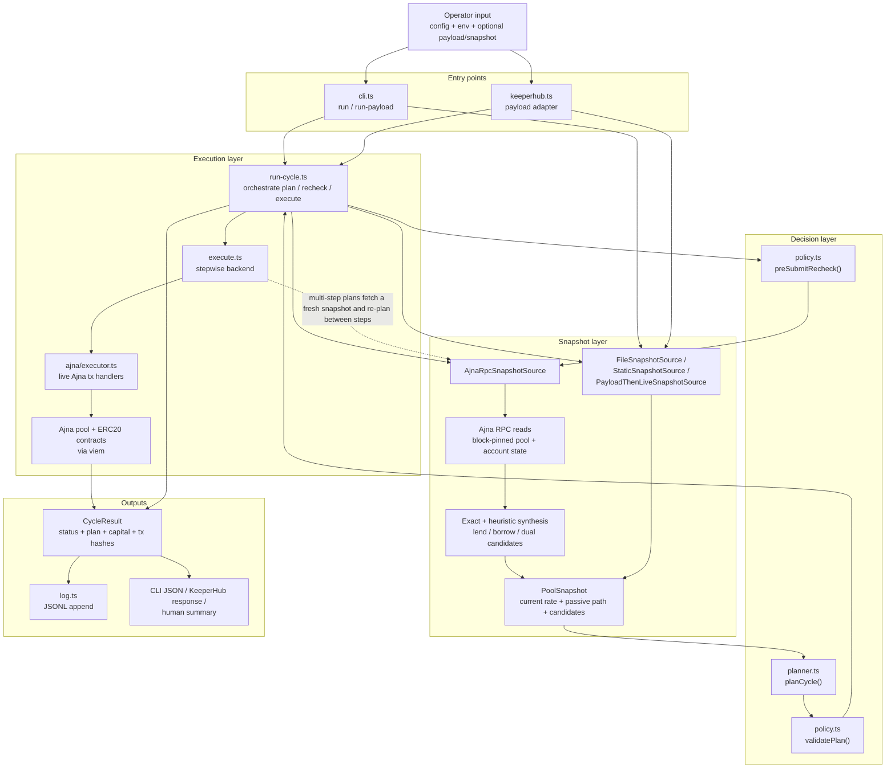
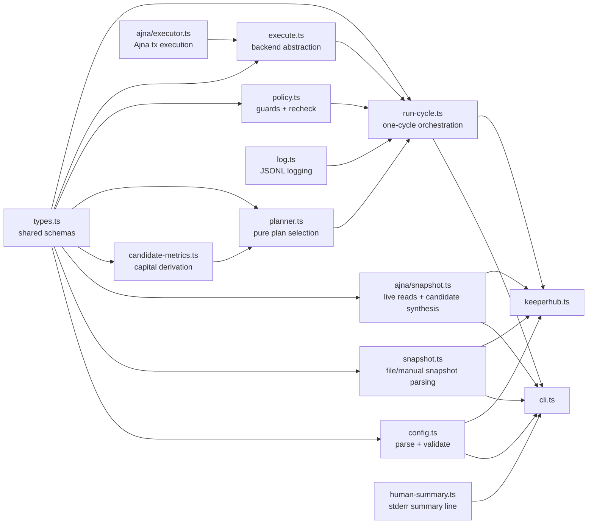
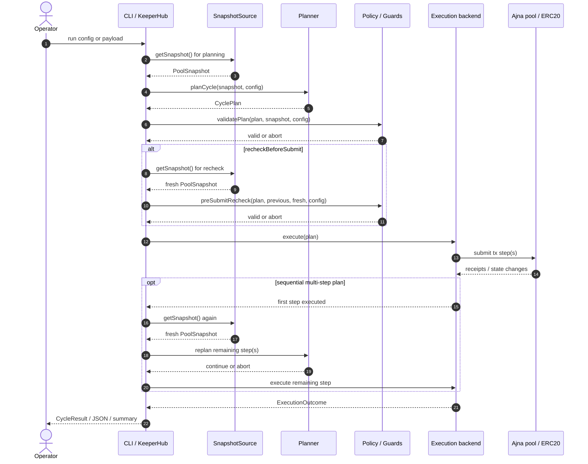

# Ajna Interest Rate Keeper Design

Generated from `/office-hours` and `/plan-eng-review` on 2026-03-24/25.

## Status

- Product design: approved
- Eng review: cleared
- Scope: reduced for v1

## Problem Statement

Ajna pool creators need a cheap, maintainable, and effective way to steer a pool's
interest-rate trajectory toward a desired target when the default starting rate or
current pool state does not match market expectations.

The first practical use case is a keeper that, on Ajna's 12-hour cadence, makes
bounded lend and/or borrow moves so the next protocol rate update moves in the
desired direction until the pool reaches the target zone.

## Goals

- Optimize for correctness, maintainability, and low operator friction.
- Reuse one deterministic engine across delivery surfaces.
- Support direct use and KeeperHub without duplicating business logic.
- Minimize capital deployed while still reliably changing the next-rate outcome.
- Handle abandoned/out-of-range pools, including reset-to-10 behavior.

## Product Modes

The design should treat the keeper as several related product modes, not one undifferentiated "target rate" problem.

### 1. Brand-New Pool, Downward Convergence

This is the case where a newly created pool should move down faster or continue moving down safely.

- dominant primitives: `UPDATE_INTEREST`, sometimes `LEND`
- strongest current evidence

This mode is close to:
- new or thin quote-heavy pools
- underutilized pools where passive updates or quote-side nudges are sufficient

### 2. Brand-New Pool, Upward Convergence

This is the case where a newly created pool should move up faster than passive updates would allow.

- dominant primitive: `BORROW`
- materially harder than downward convergence

This mode should be treated separately from abandoned-pool reset/recovery. The protocol mechanics and the keeper evidence are different.

### 3. Abandoned High-Rate Reset / Recovery

This is the thin-pool reset-to-10 regime and the recovery path around it.

- dominant primitive: explicit `RESET_TO_TEN` outcome modeling
- related to low meaningful utilization at high rates
- not equivalent to "brand-new pool should move upward"

### 4. Mixed Two-Sided Correction

This is the case where `LEND_AND_BORROW` beats single-sided actions.

- dominant primitive: exact `ADD_QUOTE -> DRAW_DEBT`
- separate from both pure downward and pure upward single-sided cases

### Current Validation Status

The current implementation/testing evidence should be understood through this capability matrix:

| Pool type | Move rate down toward target | Move rate up toward target |
| --- | --- | --- |
| Brand-new pools | proven for repeated update-only convergence and representative due-window `LEND` planning | supported only through representative multi-cycle `BORROW`; exact same-cycle borrower steering remains experimental / unsupported |
| Abandoned high-rate pools | modeled and partly covered through `RESET_TO_TEN` forecasting plus shared downward engine behavior, but not separately proven end-to-end as its own live strategy | not separately proven; only the shared representative multi-cycle borrower path exists, not an abandoned-pool-specific upward proof |
| Existing used pools | proven in representative cases; due-window `LEND` is proven and deterministic exact pre-window surfaced-plan coverage now exists, while broader pre-window execution remains experimental | supported in representative multi-cycle `BORROW` cases and representative due-window exact `LEND_AND_BORROW` cases; exact same-cycle borrower steering remains experimental / unsupported |

Practical product conclusion:
- downward convergence is the strongest supported behavior
- upward convergence is currently a multi-cycle borrower problem, not a same-cycle borrower-flip problem
- exact block-pinned real used-pool upward archetypes now exist in the experimental suite, and they still do not surface a generic exact upward simulation candidate
- even when those pinned real used-pool states are paired with recent real lender addresses from quote-token transfers into the pool, the generic exact paired `LEND_AND_BORROW` search still does not surface an upward candidate
- abandoned-pool reset/recovery is modeled correctly, but still should not be marketed as a separately proven end-to-end mode

### Current Product Conclusion For Borrower Steering

The implementation and fork evidence now support a clearer product stance:

- operators should still configure only the pool, target band, and risk limits
- the engine should choose the best available borrower-side tactic internally
- exact same-cycle `BORROW` should be treated as experimental, not as the default upward-steering primitive
- the default proven upward-steering path is multi-cycle borrower positioning over the next eligible updates
- heuristic same-cycle `BORROW` can still be useful as exploratory operator guidance, but not as a proven automatic execution path

Why:

- brand-new quote-only fixtures remain negative for exact same-cycle borrower steering
- true existing-borrower fixtures remain negative for exact same-cycle borrower steering
- deliberately borrower-heavy existing-loan fixtures also remain negative for exact same-cycle borrower steering
- representative multi-cycle borrower steering is positively proven
- deterministic not-due quote-only fixtures can now surface and targeted-execute an exact pre-window borrower plan, but that remains experimental rather than routine supported execution
- representative existing-borrower and complex ongoing multi-actor borrower fixtures still remain negative for generic exact pre-window borrower steering
- bounded manual multi-cycle pre-window borrower probes across those used-pool fixture families also remain negative so far, the newer boundary-math-ranked existing-borrower pre-window search remains negative as well, and even a representative multi-bucket existing-borrower pre-window borrower probe stays negative after ranking candidates with a protocol-grounded cached-interest-state approximation, which suggests the deterministic quote-only pre-window borrower proof is still a narrow case rather than a generalized used-pool control path
- protocol source inspection now explains the main split: in normal due-window states Ajna computes the next rate move from previously cached `interestParams` values and only writes the fresh debt/deposit/debtCol/lupt0Debt inputs after that calculation, so default exact borrower search should focus on pre-window and multi-cycle paths instead of due-window same-cycle search

So for v1/v1.1, upward convergence should be implemented as an internal policy ladder:

- first, use the strongest exact borrower-side tactic that is actually proven for the current state
- if exact same-cycle `BORROW` is not proven/available, fall back to exact multi-cycle `BORROW`
- if no exact borrower path exists, heuristic same-cycle `BORROW` can still be surfaced for recommendation or dry-run contexts

This is not intended to become a user-facing per-pool strategy setting.

## Non-Goals

- No new smart contracts in v1.
- No multi-pool or multi-chain orchestration in v1.
- No dedicated long-lived VPS adapter in v1.
- No website widget in v1.
- No gas-optimization engine or dynamic fee strategy in v1.
- No atomic/private-bundle execution backend in v1.

## v1 Scope

v1 is one deterministic one-shot cycle engine for one pool on one chain.

Supported entrypoints:
- CLI one-shot command
- KeeperHub invocation of the same one-shot cycle

VPS support in v1:
- `cron` or `systemd` runs the same one-shot command

## What Already Exists

- `AjnaPoker` proves the value of a narrow automated rate updater.
- `4626-ajna-vault-keeper` proves the off-chain keeper shape and safety-first cadence.
- KeeperHub already handles scheduling, retries, gas estimation, transaction ordering,
  and wallet execution.
- Ajna core docs/audits define the protocol mechanics and footguns this keeper must model.

## Core Product Decisions

### 1. One Brain, Many Thin Wrappers

The keeper should have one deterministic decision engine and thin adapters around it.
The wrappers translate inputs/outputs, but they do not own keeper logic.

### 2. Targets Use a Band, Not an Exact Point

Ajna moves rates in coarse protocol steps. The keeper should treat completion as
"inside target band" rather than "equal to exact number".

Recommended config shape:
- `targetRateBps`
- `toleranceBps` or `tolerancePct`
- `toleranceMode = relative`
- `completionPolicy = in_band | next_move_would_overshoot`

### 3. Planner Must Be Pure

The planner is a pure function:

```text
snapshot + config -> closed action plan
```

No RPC reads, clock reads, env lookups, or wallet behavior inside the planner.

### 4. Closed Action Schema

The planner emits exactly one of:
- `NO_OP`
- `LEND`
- `BORROW`
- `LEND_AND_BORROW`

Each plan includes explicit amounts, bounds, and reason metadata.

This is the top-level intent layer. It is intentionally small and stable.
The executor should translate each intent into the minimum concrete Ajna action
sequence needed to achieve that intent for the current pool state.

## Intent Layer vs Execution Step Layer

The keeper should distinguish between:

- **Intent layer**: what the keeper is trying to accomplish this cycle
- **Execution step layer**: the exact Ajna calls required to realize that intent

Top-level planner intents remain:
- `NO_OP`
- `LEND`
- `BORROW`
- `LEND_AND_BORROW`

Executor step vocabulary should be broader and explicit:
- `ADD_QUOTE`
- `REMOVE_QUOTE`
- `DRAW_DEBT`
- `REPAY_DEBT`
- `ADD_COLLATERAL`
- `REMOVE_COLLATERAL`
- `UPDATE_INTEREST`

Rules:
- The planner should output the top-level intent plus sizing/bounds.
- The executor should compile that intent into the minimum concrete step sequence
  required for the current state.
- The step sequence should be as short as possible for the chosen intent.
- Do not collapse the planner down to raw protocol calls. Keep the intent model small.

Examples:
- `LEND` may compile to `[ADD_QUOTE]`
- `BORROW` may compile to `[DRAW_DEBT]` if collateral is already in place
- `LEND_AND_BORROW` may compile to `[ADD_QUOTE, DRAW_DEBT]`
- if the pool is already correctly positioned and the 12-hour window is open, a cycle may compile to `[UPDATE_INTEREST]`
- if the pool must be nudged and the update window is already open, a cycle may compile to
  `[ADD_QUOTE, UPDATE_INTEREST]`, `[DRAW_DEBT, UPDATE_INTEREST]`, or
  `[ADD_QUOTE, DRAW_DEBT, UPDATE_INTEREST]`
- terminal unwind after convergence may compile to `[REPAY_DEBT, REMOVE_QUOTE]`
- if borrower collateral must be established or removed by the keeper, setup/terminal
  flows may also include `ADD_COLLATERAL` or `REMOVE_COLLATERAL`

### 5. Safety Comes From Guard Rails, Not Cleverness

The keeper should be convergence-first, not gas-trader-first.

Safety comes from:
- target band
- explicit next-rate outcome modeling
- block-pinned snapshot
- stale-state detection
- pre-submit recheck
- hard caps
- explicit partial-success handling

## Protocol Outcome Model

The planner must explicitly model Ajna next-rate outcomes:
- `STEP_UP`
- `STEP_DOWN`
- `RESET_TO_TEN`
- `NO_CHANGE`

This is required because abandoned/out-of-range pools are one of the main use cases.

## Convergence Rule

The keeper does not ask "is this action large enough?"
It asks "does this action change the next Ajna rate outcome in the direction we want?"

The planner should compute the minimum directional threshold from pool state, then the
executor should use:

```text
execution_amount = minimum_directional_threshold + explicit_small_buffer
```

This avoids knife-edge execution that fails due to rounding or state drift.

Suggested config:
- `thresholdMode = minimum_directional`
- `executionBufferBps`
- `maxQuoteSize`
- `maxBorrowExposure`
- `roundingMode`
- `recheckBeforeSubmit = true`

## Architecture

### High-Level Flow



Operationally, the architecture is split into four layers:
- entrypoints: CLI and KeeperHub normalize config and runtime mode
- snapshot: build a block-pinned `PoolSnapshot` and synthesize candidate actions
- decision: pick one closed-form plan and apply guard checks
- execution: submit steps, re-read/re-plan between sequential actions, then emit structured results

### Proposed Module Layout

Keep v1 flat and functional, not class-heavy:



### `runCycle()` Sequence



Module responsibilities:
- `types.ts`: shared typed schemas
- `config.ts`: parse/validate config
- `snapshot.ts`: generic file/manual snapshot parsing plus `SnapshotSource` helpers
- `ajna/snapshot.ts`: block-pinned Ajna RPC reads, passive-path classification, exact/heuristic synthesis
- `planner.ts`: pure decision logic and plan-capital derivation
- `policy.ts`: caps, stale guards, unsafe-window guards, pre-submit recheck
- `execute.ts`: transaction submission abstraction and stepwise execution backend
- `ajna/executor.ts`: live Ajna transaction handlers
- `log.ts`: append-only structured run logs
- `run-cycle.ts`: orchestration of one cycle
- `cli.ts`: one-shot local entrypoint
- `keeperhub.ts`: one-shot KeeperHub adapter

## Snapshot and Read Strategy

Use direct onchain reads only in v1.

Requirements:
- one block-pinned snapshot
- batched via `viem.multicall` where possible
- no subgraph or cached indexer in the decision path

This avoids mixed-time data and extra infrastructure.

## Freshness and Timing Guards

Each cycle should have explicit guard config:
- `snapshotAgeMax`
- `minTimeBeforeRateWindow`
- `preSubmitRecheck = true`

Execution should abort if:
- snapshot is too old
- pool state changed materially after planning
- execution is too close to an unsafe timing window
- re-read state no longer supports the planned action

## Execution Semantics

### Single-Action Plans

- `NO_OP`: return structured result with reason
- `LEND`: execute one lend action
- `BORROW`: execute one borrow action

### Dual-Action Plans

For `LEND_AND_BORROW`, v1 uses sequential execution:

```text
plan
  -> execute step 1
  -> re-read / recheck
  -> execute step 2 if still valid
```

If step 1 succeeds and step 2 fails:
- record partial success explicitly
- record tx hashes and failure reason
- do not hide the intermediate state
- allow the next cycle to replan from the new actual state

This is the boring portable baseline.

### Interest-Update Action

Ajna requires an explicit `updateInterest()` call. Positioning the pool is not enough by
itself to change the displayed rate. The keeper therefore needs an executor-level
`UPDATE_INTEREST` step so it can:

- perform AjnaPoker-style update-only runs when the pool is already correctly positioned
- append the actual rate-update call after positioning when the update window is open
- avoid relying on unrelated third parties to poke the pool after the keeper has done the work

### Minimum-Step Principle

For each cycle, the executor should use the minimum concrete Ajna step sequence that
achieves the selected top-level intent.

Examples:
- If rate steering only requires fresh lender liquidity, use `ADD_QUOTE` only.
- If rate steering only requires borrower-side pressure and collateral is already
  positioned, use `DRAW_DEBT` only.
- If both sides are needed, use the shortest valid ordered sequence, such as
  `ADD_QUOTE -> DRAW_DEBT`.

The keeper should not add recovery or cleanup steps to normal convergence cycles
unless those steps are required to achieve the selected intent safely.

### Capital Recovery Policy

Capital recovery is a separate phase from directional convergence.

For v1:
- prioritize the minimum step sequence needed to push the next-rate outcome in the
  desired direction
- allow exposure to remain in place across cycles, subject to caps
- treat recovery/unwind as a terminal action when the pool reaches the target band,
  the operator stops the keeper, or a safety rule forces exit

This means the keeper does **not** need to perform a full open/close loop every cycle.
It should converge first, then unwind deliberately.

Typical terminal recovery flow:

```text
target reached or stop requested
            |
            v
      repay debt if needed
            |
            v
     remove quote liquidity
            |
            v
   optionally remove collateral
```

Whether collateral removal is part of v1 depends on whether the keeper itself owns and
manages borrower collateral, or whether collateral is assumed to already exist outside
the keeper's normal cycle control.

## Logging and Observability

v1 should not require a database, but it should not rely on stdout alone.

Use append-only structured run logs, for example JSONL, with:
- timestamp
- pool identifier
- chain id
- snapshot fingerprint or block number
- predicted next-rate outcome
- chosen plan type
- threshold calculation inputs
- guard results
- tx hashes
- final outcome
- partial-success details if applicable

Log-write failure should be visible, but should not hide a successful onchain action.

## Configuration

Suggested config surface for v1:

```text
chainId
poolAddress / pool identifier
targetRateBps
tolerancePct or toleranceBps
completionPolicy
maxQuoteSize
maxBorrowExposure
executionBufferBps
snapshotAgeMax
minTimeBeforeRateWindow
optionalMaxGasCostKillSwitch
logPath
```

Notes:
- Gas should not be part of planner scoring in v1.
- A max gas cost can exist only as an optional high kill-switch guard.

## Testing Strategy

v1 requires a three-layer test pyramid:

### 1. Unit Tests

Framework:
- TypeScript
- Vitest

Focus:
- config validation
- next-rate outcome classification
- planner decisions
- target band logic
- threshold calculation
- guard behavior

### 2. Fork / Integration Tests

Stack:
- viem
- Anvil fork

Focus:
- real Ajna contract behavior
- `STEP_UP`, `STEP_DOWN`, `RESET_TO_TEN`, `NO_CHANGE`
- single-action execution
- sequential dual-action execution
- partial-success path
- stale-state / recheck abort behavior

### 3. Thin End-to-End Tests

Focus:
- CLI one-shot execution path
- KeeperHub adapter serialization and branching output
- structured log append behavior

## Failure Modes

### Stale State Near Boundary

Risk:
- planner acts on outdated state and moves the pool incorrectly

Mitigation:
- block-pinned snapshot
- `snapshotAgeMax`
- `minTimeBeforeRateWindow`
- pre-submit recheck

### Reset-to-10 Pools

Risk:
- planner assumes normal step logic and takes the wrong side of the market

Mitigation:
- explicit `RESET_TO_TEN` modeling
- dedicated tests

### Dual-Action Partial Completion

Risk:
- first tx lands, second tx fails, pool state changes unexpectedly

Mitigation:
- sequential semantics made explicit
- post-step recheck
- structured logs
- next-cycle replanning

### Ineffective Churn

Risk:
- repeated actions that do not change the next-rate outcome

Mitigation:
- planner no-ops unless action changes predicted next-rate outcome or improves convergence

### Logging Failure

Risk:
- keeper acts successfully but post-run trace is missing

Mitigation:
- log failure is surfaced separately
- tx outcome remains primary result

## Distribution Plan

Primary artifact:
- open-source TypeScript package and CLI

Distribution:
- npm package
- GitHub Releases

Execution surfaces:
- local CLI
- KeeperHub invocation
- VPS via `cron`/`systemd` running the same one-shot command

CI/CD:
- GitHub Actions for lint, typecheck, test, build
- publish on tag

## Deferred Work

See [TODOS.md](./TODOS.md) for deferred work:
- multi-pool / multi-chain orchestration
- recommendation widget
- private bundle / atomic execution backend

## Recommended Next Steps

1. Scaffold the TypeScript package with Vitest and viem.
2. Define typed schemas for `Snapshot`, `ActionPlan`, `CycleResult`, and config.
3. Implement config parsing and validation.
4. Implement block-pinned snapshot reads and outcome classification.
5. Implement pure planner logic and threshold calculation.
6. Implement guard layer and pre-submit recheck.
7. Implement direct executor and structured logging.
8. Add CLI and KeeperHub entrypoints.
9. Write unit, fork/integration, and thin E2E tests alongside each step.

## Current Implementation Notes

The current codebase now includes:
- live Ajna ABI wiring for read and write calls
- an onchain snapshot source that classifies the next Ajna rate move
- `UPDATE_INTEREST` support in the execution step vocabulary

The full onchain threshold synthesizer is not complete yet. The current live path supports
optional `manualCandidates` in config so real onchain snapshots can still be paired with
explicit candidate actions while the minimum-directional threshold engine is built out.
