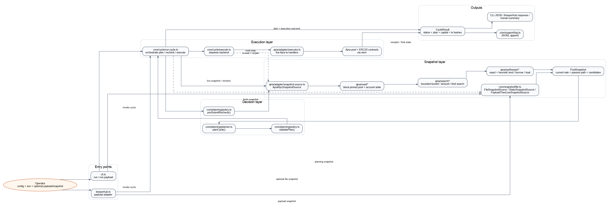

# interest-rate-keeper

Ajna interest-rate keeper for steering a pool toward a target rate on Ajna's 12-hour cadence.

This repo currently contains:
- a pure planner with a closed top-level intent model
- a live Ajna RPC snapshot source
- a live Ajna execution backend
- CLI and KeeperHub entrypoints
- unit tests plus a Base-fork integration test that uses the deployed Base Ajna ERC20 factory

The detailed product and engineering decisions are in [DESIGN.md](./DESIGN.md). The used-pool upward research boundary is summarized in [docs/used-pool-upward-control-summary.md](./docs/used-pool-upward-control-summary.md), the managed inventory-backed operating model is in [docs/curator-mode.md](./docs/curator-mode.md), and the current runtime/module explainer is in [docs/architecture.md](./docs/architecture.md). Deferred work is tracked in [TODOS.md](./TODOS.md).

Current architecture diagrams also live in [DESIGN.md#architecture](./DESIGN.md#architecture).



Rendered assets:
- [Architecture SVG](./docs/diagrams/keeper-architecture.svg)
- [Sequence SVG](./docs/diagrams/keeper-run-cycle-sequence.svg)
- [Sequence PNG](./docs/diagrams/keeper-run-cycle-sequence.png)

## Module Flow

At a high level, the runtime flow is:

`config -> core snapshot interface -> ajna adapter -> ajna read -> ajna search -> ajna synthesize -> core planner -> core policy -> core cycle runner -> ajna executor`

Current source layout:

- `src/core/config/*`: config parsing and normalization
- `src/core/snapshot/*`: generic snapshot types, metadata, and file/payload sources
- `src/core/planning/*`: planner, policy, managed-control rules, and capital metrics
- `src/core/cycle/*`: execution backend abstraction and one-cycle orchestration
- `src/ajna/adapter/*`: Ajna-specific wiring into the core engine
- `src/ajna/read/*`: authoritative onchain reads and caches
- `src/ajna/search/*`: bounded candidate-space construction
- `src/ajna/synthesize/*`: exact and heuristic candidate evaluation
- `src/ajna/math/*`: Ajna rate math and constants
- `src/ajna/dev/*`: fork/testing helpers

For the fuller end-to-end explainer, see [docs/architecture.md](./docs/architecture.md).

## Status

This is still an early but working implementation. The core keeper loop, live Ajna snapshot source, live execution backend, and Base-fork coverage are all in place.

Supported surface today:

- downward convergence is the strongest path
- representative due-window `LEND` planning is proven
- representative exact due-window `LEND_AND_BORROW` execution is proven
- representative exact multi-cycle `BORROW` execution is proven for upward steering
- managed used-pool upward control through curator-style inventory-backed `REMOVE_QUOTE` is end-to-end verified on the dog/USDC archetype: the candidate surfaces, the planned call executes on the forked pool, and the realized on-chain rate after the next Ajna rate update matches the simulation prediction exactly (see the [Operator Runbook](./docs/curator-mode.md#operator-runbook) for how to enable it safely)
- the keeper aborts safely when pool state changes between planning and execution, including per-bucket withdrawable depletion and lender-bucket-state drift
- dry-run, capital metrics, validation signatures, and submit-time recheck are all wired into the live path

Experimental or narrow surface:

- generic pre-window `LEND` is not a broad supported live feature yet, even though there are real positive proofs in deterministic and representative fixtures
- pre-window `BORROW` exists in narrow exact proofs, but it is not a broad used-pool upward solution
- heuristic candidates still exist for exploration and dry runs, but they are recommendation-only unless `allowHeuristicExecution` is explicitly enabled

Not broadly supported:

- generic used-pool upward control without an operator's standing lender inventory
- exact same-cycle borrower-side steering
- managed dual `REMOVE_QUOTE + DRAW_DEBT` as a routine surfaced live path (exact synthesis has not surfaced a dual candidate on any pinned archetype even with bucket + limit seeding)

Important runtime behavior:

- when synthesis flags are unset, the live snapshot source follows an internal ladder instead of requiring operators to choose a borrower strategy
- exact candidates are downgraded to `unsupported` when they were derived from a `simulationSenderAddress` that does not match the live execution signer
- `manualCandidates` are now a fallback/override bridge, not the default live mechanism
- candidate usefulness is judged against the passive next-update path, not just the current rate

For the detailed research boundary and actual-chain evidence, see [docs/used-pool-upward-control-summary.md](./docs/used-pool-upward-control-summary.md). For the managed-pool operating model, see [docs/curator-mode.md](./docs/curator-mode.md).

## Product Modes

The keeper should be thought of as several related product modes, not one generic "steer the rate" problem.

### 1. Brand-New Pool, Target Rate Below Current Trajectory

This is the "new pool is too expensive / should drift down faster" case.

- closest keeper primitive: `UPDATE_INTEREST` and `LEND`
- protocol shape: quote-heavy / underutilized pool
- current evidence: strongest

What is proven today:
- repeated update-only convergence over roughly a week
- representative due-window `LEND` planning

### 2. Brand-New Pool, Target Rate Above Current Trajectory

This is the "new pool should move up faster than passive updates would allow" case.

- closest keeper primitive: `BORROW`
- protocol shape: borrower-side steering from a low-rate pool
- current evidence: partial

What is proven today:
- representative multi-cycle `BORROW` planning and live execution
- the live exact borrower path now automatically attempts a multi-cycle fallback when same-cycle exact borrow is unavailable and no explicit lookahead is configured
- the live snapshot source now encodes that borrower policy internally when synthesis flags are unset, instead of requiring operators to choose a borrower strategy

What is not proven today:
- exact same-cycle borrower-side steering

### 3. Abandoned High-Rate Pool / Reset-To-Ten Behavior

This is not the same as a new pool. Ajna has special reset behavior for thin high-rate pools.

- closest keeper primitive: explicit `RESET_TO_TEN` outcome modeling
- protocol shape: low meaningful utilization at rate > `10%`
- current evidence: modeled and forecast, but not a distinct live keeper strategy beyond the shared engine

### 4. Mixed Two-Sided Correction

This is the case where quote and borrow actions together beat either side alone.

- closest keeper primitive: `LEND_AND_BORROW`
- protocol shape: direct `ADD_QUOTE -> DRAW_DEBT` path
- current evidence: representative due-window exact dual execution is proven

### Capability Matrix

| Pool type | Move rate down toward target | Move rate up toward target |
| --- | --- | --- |
| Brand-new pools | proven for update-only convergence and representative due-window `LEND` planning | supported only through representative multi-cycle `BORROW`; exact same-cycle `BORROW` remains experimental / unsupported |
| Abandoned high-rate pools | modeled and partly covered through `RESET_TO_TEN` forecasting plus shared downward engine behavior, but not separately proven end-to-end as its own live strategy | not separately proven; only the shared representative multi-cycle borrower path exists, not an abandoned-pool-specific upward proof |
| Existing used pools | proven in representative cases; due-window `LEND` is proven and deterministic exact pre-window surfaced-plan coverage exists, while broader pre-window execution remains experimental | supported in representative multi-cycle `BORROW` cases and representative due-window exact `LEND_AND_BORROW` cases, and supported through curator-mode inventory-backed `REMOVE_QUOTE` for operators with standing lender LP in a pinned archetype (end-to-end verified on dog/USDC); exact same-cycle `BORROW` and exact dual `REMOVE_QUOTE + DRAW_DEBT` remain experimental / unsupported |

Practical reading:
- downward convergence is the strongest part of the system today
- upward convergence for brand-new pools is supported primarily through multi-cycle `BORROW`, not same-cycle borrower steering
- exact block-pinned real used-pool upward archetypes now exist in the experimental suite, and they still do not surface a generic exact upward simulation candidate (generic discovery remains unsupported)
- even when those pinned real used-pool states are paired with recent real lender addresses from quote-token transfers into the pool, the generic exact paired `LEND_AND_BORROW` search still does not surface an upward candidate
- for used pools, the supported upward path is curator-mode managed `REMOVE_QUOTE` when the operator has standing lender LP in the target bucket; see [docs/curator-mode.md](./docs/curator-mode.md) including the Operator Runbook section
- abandoned-pool reset/recovery is modeled correctly, but not yet proven as a distinct end-to-end product mode

## Terms

- `same-cycle`: act now so the very next eligible Ajna rate update moves in the desired direction or stays inside the target band
- `multi-cycle`: act now because, even if the next single update is still imperfect, the next few eligible Ajna updates converge better than the passive do-nothing path
- `passive path`: the projected rate path if the keeper does nothing
- `lookahead`: how many future eligible updates the borrower-side exact search evaluates when judging convergence

## How Multi-Cycle Works

Multi-cycle planning is not assuming the keeper can predict the pool forever while ignoring other actors. It is a bounded planning heuristic:

- take a fresh snapshot of current pool state
- simulate a no-op baseline over the next `N` eligible updates
- simulate one or more keeper actions over the same `N`-update horizon
- choose the action only if that action improves the bounded horizon relative to the passive path
- rerun the whole process again on the next keeper cycle from fresh live state

So the keeper is not saying "I know exactly what the pool will do for the next week." It is saying "from the current state, this action improves the next few Ajna updates more than doing nothing, and I will re-evaluate again later."

External actors still matter:

- they can invalidate the current plan before execution, which is why the keeper rechecks state before submit
- they can change the pool after this cycle, which is why multi-cycle planning is implemented as repeated replanning, not as one fixed long-lived commitment
- the more active the pool is, the less confidence you should place in long-horizon forecasts

## Requirements

- Node.js `>=20.5.0`
- `npm`
- Foundry (`forge` and `anvil`) for fork integration tests

## Install

```bash
npm install
```

## Commands

```bash
npm run build
npm run lint
npm run typecheck
npm run render:diagrams
npm run verify
npm test
npm run test:integration:base:smoke
npm run test:integration:base
npm run test:integration:base:slow
npm run test:integration:base:stress
npm run test:integration:base:experimental
npm run test:integration:base:all
```

Notes:
- `npm test` runs the fast unit suite only.
- `npm run lint` runs the repo ESLint pass over the current project tree.
- `npm run render:diagrams` regenerates the architecture and run-cycle diagram assets from the DOT sources in `docs/diagrams/`.
- `npm run verify` runs `lint + typecheck + unit tests + build` and is the same gate used by CI and publish workflows.
- `npm run test:integration:base:smoke` runs the smallest Base-fork health checks through the managed fork runner.
- `npm run test:integration:base` runs the broader default Base-fork integration profile in [`tests/integration/base/index.integration.ts`](./tests/integration/base/index.integration.ts) through the managed fork runner.
- `npm run test:integration:base:slow` runs the slower but still routine exact-path proofs through the managed fork runner.
- `npm run test:integration:base:stress` runs the heavier but consistently passable managed-local-Anvil proofs.
- `npm run test:integration:base:experimental` runs the longest algorithmic exact-search proofs, including the broader existing-borrower same-cycle borrow scan. These are exploratory and can still take many minutes.
- `npm run test:integration:base:all` runs every profile together, including `experimental`, and also uses the managed local-Anvil path.
- Base-fork package scripts require either:
  `BASE_LOCAL_ANVIL_URL` pointing at an already-running Base fork you control, or `BASE_RPC_URL` so the managed runner can start its own local fork.
- If `BASE_LOCAL_ANVIL_URL` is unset, the managed fork runner picks a profile-specific free local port, starts its own local Anvil fork there, and tears it down after the run.
- If `BASE_LOCAL_ANVIL_URL` is set, the test harness reuses that already-running local Anvil fork instead of spawning a fresh one.
- The Base integration test logs the selected profile plus either the explicit reused local fork host or the spawned upstream/local hosts at startup.
- CLI `run` output now carries the selected plan's capital metrics directly on `plan`, and KeeperHub responses include the same values under `capital`, including curator-facing `quoteInventoryDeployed` and `quoteInventoryReleased`.

## CI/CD

- [ci.yml](./.github/workflows/ci.yml) runs `npm run verify` on every push/PR and, when `BASE_RPC_URL` is available as a GitHub secret, runs both the Base smoke and routine default fork profiles.
- [publish.yml](./.github/workflows/publish.yml) runs on `v*` tags, reruns `npm run verify`, conditionally runs the routine Base slow fork profile when `BASE_RPC_URL` is available, publishes to npm using `NPM_TOKEN`, and creates a GitHub release.
- `npm pack --dry-run` now produces a clean package containing the built CLI/library artifacts from `dist/src`.

## Env Files

The CLI and Base-fork integration test now load `.env` automatically via `dotenv`. Existing shell environment variables still win, so you can always override values for a single command without editing the file.

Start from:

```bash
cp .env.example .env
```

Typical local values:

```dotenv
BASE_RPC_URL=https://your-base-rpc.example
BASE_LOCAL_ANVIL_URL=http://127.0.0.1:9545
BASE_ACTIVE_POOL_ADDRESS=0x...
AJNA_KEEPER_PRIVATE_KEY=0x...
```

`BASE_LOCAL_ANVIL_URL` is optional. When set, the integration harness expects an already-running Anvil-compatible local fork and reuses it for snapshot/revert/time-travel instead of spawning its own process. This is the most robust way to run the heavier Base-fork profiles when sandboxed fork startup or upstream DNS has been flaky.

When you set `BASE_LOCAL_ANVIL_URL`, the runner trusts that endpoint and does not reset or sanitize it. Point it at a clean Base fork that you control, or let the managed runner start an isolated local fork for the current profile instead.

`BASE_ACTIVE_POOL_ADDRESS` is optional. When set, the real active-pool replay test skips factory-log discovery and replays against that specific Base pool instead.

Recommended heavy-test workflow:

```bash
anvil --fork-url "$BASE_RPC_URL" --port 9545 --chain-id 8453 --silent
BASE_LOCAL_ANVIL_URL=http://127.0.0.1:9545 npm run test:integration:base:slow
```

For the heaviest representative proofs, prefer:

```bash
BASE_LOCAL_ANVIL_URL=http://127.0.0.1:9545 npm run test:integration:base:stress
```

For the longest exploratory exact-search proofs, use:

```bash
BASE_LOCAL_ANVIL_URL=http://127.0.0.1:9545 npm run test:integration:base:experimental
```

If `BASE_LOCAL_ANVIL_URL` is unset, all Base-fork package scripts automatically start a managed local Anvil fork on a profile-specific free local port, run the suite there, then shut it down when the run finishes. That managed path requires `BASE_RPC_URL`.

## CLI Usage

Build first:

```bash
npm run build
```

Dry-run from a config file:

```bash
node dist/src/cli.js run --config ./keeper.config.json --dry-run
```

Run against a live Ajna pool:

```bash
node dist/src/cli.js run --config ./keeper.config.json
```

KeeperHub-style payload execution:

```bash
node dist/src/cli.js keeperhub --payload ./keeperhub-payload.json --dry-run
```

When KeeperHub payload config includes `poolAddress` and `rpcUrl`, the adapter now uses the payload snapshot for planning and a live Ajna RPC read for the submit-time recheck. If the payload cannot support a live recheck, the adapter disables `recheckBeforeSubmit` instead of pretending the second read happened.

CLI flags:
- `run --config <path>`
- `run --config <path> --snapshot <path>`
- `keeperhub --payload <path>`
- `--dry-run`
- `--summary`

If `--snapshot` is omitted in `run` mode, the CLI uses the live Ajna RPC snapshot source.
If `--summary` is passed, the CLI writes a short human-readable capital summary to `stderr` while keeping the structured JSON output on `stdout` unchanged.
`--dry-run` results now include `dryRun: true`, and if a heuristic candidate was selected for recommendation the output also carries `selectedCandidateExecutionMode: "advisory"` so it is not confused with a live-safe plan.

## Minimal Config Shape

```json
{
  "chainId": 8453,
  "poolAddress": "0x0000000000000000000000000000000000000000",
  "targetRateBps": 800,
  "toleranceBps": 50,
  "toleranceMode": "relative",
  "completionPolicy": "next_move_would_overshoot",
  "executionBufferBps": 50,
  "maxQuoteTokenExposure": "1000000000000000000000000",
  "maxBorrowExposure": "1000000000000000000000000",
  "snapshotAgeMaxSeconds": 90,
  "minTimeBeforeRateWindowSeconds": 120,
  "minExecutableQuoteTokenAmount": "1",
  "minExecutableBorrowAmount": "1",
  "minExecutableCollateralAmount": "1",
  "recheckBeforeSubmit": true,
  "rpcUrl": "https://mainnet.base.org"
}
```

Optional live-execution fields:
- `borrowerAddress`
- `recipientAddress`
- `logPath`
- `manualCandidates`
- `maxGasCostWei`
- `allowHeuristicExecution`
- `addQuoteBucketIndex`
- `addQuoteBucketIndexes`
- `addQuoteExpirySeconds`
- `enableSimulationBackedLendSynthesis`
- `enableSimulationBackedBorrowSynthesis`
- `enableManagedInventoryUpwardControl`
- `enableManagedDualUpwardControl`
- `minimumManagedImprovementBps`
- `maxManagedInventoryReleaseBps`
- `minimumManagedSensitivityBpsPer10PctRelease`
- `removeQuoteBucketIndex`
- `removeQuoteBucketIndexes`
- `simulationSenderAddress`
- `drawDebtLimitIndex`
- `drawDebtLimitIndexes`
- `drawDebtCollateralAmount`
- `drawDebtCollateralAmounts`
- `borrowSimulationLookaheadUpdates`
- `enableHeuristicLendSynthesis`
- `enableHeuristicBorrowSynthesis`

The non-obvious flags are best understood by function:

- execution/context:
  `borrowerAddress`, `recipientAddress`, `logPath`, `maxGasCostWei`
- heuristic execution gate:
  `allowHeuristicExecution`
- manual override path:
  `manualCandidates`
- lend-side exact-search overrides:
  `addQuoteBucketIndex`, `addQuoteBucketIndexes`, `addQuoteExpirySeconds`
- borrow-side exact-search overrides:
  `drawDebtLimitIndex`, `drawDebtLimitIndexes`, `drawDebtCollateralAmount`, `drawDebtCollateralAmounts`, `borrowSimulationLookaheadUpdates`
- simulation/exact-path control:
  `simulationSenderAddress`, `enableSimulationBackedLendSynthesis`, `enableSimulationBackedBorrowSynthesis`
- heuristic recommendation control:
  `enableHeuristicLendSynthesis`, `enableHeuristicBorrowSynthesis`
- managed inventory-backed upward control:
  `enableManagedInventoryUpwardControl`, `enableManagedDualUpwardControl`, `minimumManagedImprovementBps`, `maxManagedInventoryReleaseBps`, `minimumManagedSensitivityBpsPer10PctRelease`, `removeQuoteBucketIndex`, `removeQuoteBucketIndexes`

Practical reading:

- most operators should leave the synthesis flags unset and let the live snapshot source choose the default internal policy
- most operators should leave `allowHeuristicExecution` off so heuristic candidates stay advisory-only
- the bucket / limit / collateral fields are low-level search overrides, mainly for experiments or tightly controlled deployments
- the managed inventory flags are only relevant for curator-style used-pool upward control

### Curator-Mode Config Example

For managed used-pool upward control, enable the remove-only curator path explicitly:

```json
{
  "chainId": 8453,
  "poolAddress": "0x0000000000000000000000000000000000000000",
  "rpcUrl": "https://mainnet.base.org",
  "targetRateBps": 1200,
  "toleranceBps": 50,
  "toleranceMode": "absolute",
  "maxQuoteTokenExposure": "1000000000000000000000000",
  "maxBorrowExposure": "1000000000000000000000000",
  "enableManagedInventoryUpwardControl": true,
  "minimumManagedImprovementBps": 10,
  "maxManagedInventoryReleaseBps": 2000,
  "minimumManagedSensitivityBpsPer10PctRelease": 5,
  "removeQuoteBucketIndexes": [2618]
}
```

Practical reading:
- `enableManagedInventoryUpwardControl` turns on exact managed `REMOVE_QUOTE` search for used-pool upward states.
- `minimumManagedImprovementBps` requires a real improvement margin over the passive path.
- `maxManagedInventoryReleaseBps` caps one-cycle inventory release relative to the total withdrawable managed inventory visible in the snapshot.
- `minimumManagedSensitivityBpsPer10PctRelease` is the controllability gate. It requires enough predicted band-distance improvement per 10% of managed inventory released.
- `removeQuoteBucketIndex(es)` optionally seed the keeper with known productive managed buckets.

## Live Execution Notes

The live executor currently:
- requires `AJNA_KEEPER_PRIVATE_KEY` or `PRIVATE_KEY` in the environment
- requires `poolAddress` and `rpcUrl` in config
- checks ERC20 allowance before quote-token or collateral-token moves
- estimates gas cost before each live step and aborts when the estimate exceeds `maxGasCostWei`, if that cap is configured
- does not auto-submit approval transactions for you
- treats exact simulation-backed candidates as live-executable only when the simulation sender and the live signer are the same account
- revalidates managed inventory-backed plans against the fresh snapshot before submit, including eligibility, aggregate and per-bucket withdrawable inventory, release cap, improvement floor, per-10%-release sensitivity gate, and lender-bucket-state validation signature

Supported low-level execution steps:
- `ADD_QUOTE`
- `REMOVE_QUOTE`
- `DRAW_DEBT`
- `REPAY_DEBT`
- `ADD_COLLATERAL`
- `REMOVE_COLLATERAL`
- `UPDATE_INTEREST`

Supported top-level planner intents:
- `NO_OP`
- `LEND`
- `BORROW`
- `LEND_AND_BORROW`

## Base Fork Integration Test

The Base integration test is intended to stay close to real deployed Ajna behavior:

- it forks Base with Anvil
- it deploys mock ERC20 collateral and quote tokens into the fork
- it calls the deployed Base Ajna ERC20 factory
- it creates a fresh pool through that real factory
- it advances time across real Ajna update windows and verifies planning/execution against live contract behavior

Profile reading:

- `base:smoke`: smallest health checks
- `base`: routine supported surface
  representative due-window `LEND`, representative multi-cycle `BORROW`, representative exact `LEND_AND_BORROW`, safe recheck aborts, and repeated downward convergence
- `base:slow`: routine but heavier exact-path proofs
  deterministic exact pre-window lend proof and the current managed remove-only curator proof
- `base:experimental`: broader research sweeps
  pre-window borrower/lend explorations, used-pool upward probes, and pinned-state research

Practical reading:

- `base` and `base:slow` are the routine confidence gates
- `base:experimental` is research evidence, not the supported product surface
- the detailed upward-control research boundary is documented in [docs/used-pool-upward-control-summary.md](./docs/used-pool-upward-control-summary.md)

Run it with:

```bash
npm run test:integration:base
```

## Remaining Gaps

- generic used-pool upward control is still not a supported product mode
- exact same-cycle borrower steering is still unresolved
- pre-window lend and pre-window borrow both have real positive evidence, but broader generic live support is still experimental
- managed used-pool upward control is still narrower than downward or new-pool upward control
- `manualCandidates` remain a fallback for unsupported or operator-specified plans

This section is intentionally narrower than `Status`: `Status` describes the supported and experimental surface, while `Remaining Gaps` only lists the unresolved product boundaries.

The detailed evidence and negative results live in [docs/used-pool-upward-control-summary.md](./docs/used-pool-upward-control-summary.md).
